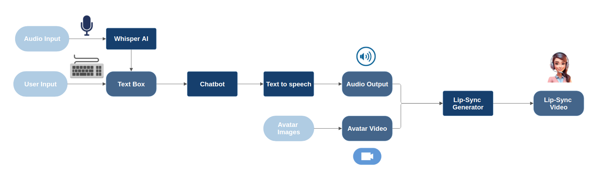

# Personalized Avatar Video - Speech to Lip-Sync

## Project Overview

This project is a **personalized avatar video generation system** that converts **spoken audio or text into a lip-synced video**. Using **speech recognition (Whisper), text-to-speech (TTS), AI chatbot (Ollama), and lip-syncing (Wav2Lip)**, it allows users to generate **realistic, expressive avatar videos**.

Users can:

1. **Upload an audio file or type text**.
2. **Generate a chatbot response** using Ollama.
3. **Convert the response into speech** using a TTS model.
4. **Sync the generated speech with a pre-selected avatar video**.
5. **Download or preview the final AI-generated avatar video**.

## Features

- **Whisper AI**: Converts speech into text.
- **Ollama Chatbot**: Generates AI-based responses.
- **Text-to-Speech (TTS)**: Converts chatbot responses into realistic speech.
- **Wav2Lip Lip-Syncing**: Creates avatar videos.
- **Gradio UI**: Provides an interactive web interface.

---

## Block Diagram



---

## Installation & Setup

Follow these steps to set up and run the project:

### 1. Clone the Repository

```sh
git clone https://github.com/your-repo-name.git
cd PersonalizedAvatarVideo
```

---

### 2. Install Dependencies

```sh
pip install -r requirements.txt
```

---

### 3. Download Wav2Lip Model

```sh
mkdir -p Wav2Lip/checkpoints
wget -O Wav2Lip/checkpoints/wav2lip_gan.pth "https://www.adrian.com/wav2lip_model.pth"
```

---

### 4. Run the Gradio UI

```sh
python gradio_ui.py
```

---

## Technologies Used

- **Python**
- **Whisper AI** for transcription
- **Google TTS** and **VITS TTS** for speech synthesis
- **Ollama AI** for chatbot response generation
- **Wav2Lip** for audio-video synchronization
- **Gradio** for UI

---

## Demo Examples

1. **User Input Audio**:
https://github.com/ndsouza1/TextToSpeech_PersonalizedAvatarVideo/blob/main/Demos/UserInput_Audio.mp4

2. **User Input Text**.
https://github.com/ndsouza1/TextToSpeech_PersonalizedAvatarVideo/blob/main/Demos/UserInput_Text.mp4

---

## Folder Structure

```sh
project-folder/ 
│-- gradio_ui.py # Main UI 
│-- whisper_tts.py # Whisper integration 
│-- ollama_chatbotTTS.py # Chatbot module 
│-- text_to_speech.py # TTS implementation 
│-- sync_audio_video.py # Lip-sync integration 
│-- assets_demo/ # Demo videos folder 
│-- sample_video/ # Predefined avatar videos 
│-- thumbnails/ # Avatar images 
│-- requirements.txt # Dependencies


```
